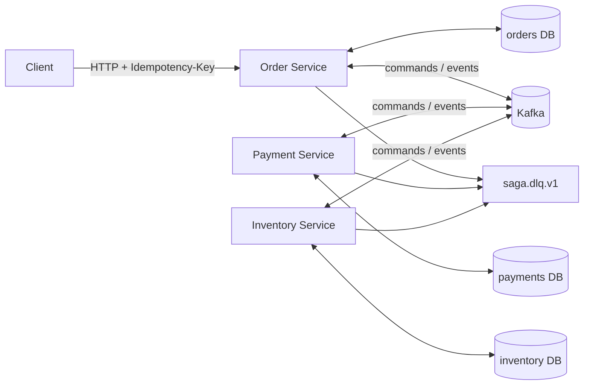

# Architecture

Status: realised

## System boundary

The system contains three independently deployable async services. They share
only versioned contracts and messaging infrastructure; they do not share
domain models or database tables.



| Service | Responsibility | Owned state |
|---|---|---|
| Order | HTTP API and Saga orchestration | orders, Saga state/history, HTTP idempotency, Inbox/Outbox |
| Payment | simulated authorization and refund | payment status/history, Inbox/Outbox |
| Inventory | stock reservation and release | stock, reservations, Inbox/Outbox |

PostgreSQL and Kafka are attached resources configured by environment
variables. All processes are stateless outside their database and broker.

## Saga state machine

| Current state | Event | Next state | Next command |
|---|---|---|---|
| `PENDING` | `OrderCreated` | `PAYMENT_PENDING` | `AuthorizePayment` |
| `PAYMENT_PENDING` | `PaymentAuthorized` | `INVENTORY_PENDING` | `ReserveInventory` |
| `PAYMENT_PENDING` | `PaymentRejected` | `CANCELLED` | — |
| `INVENTORY_PENDING` | `InventoryReserved` | `CONFIRMED` | — |
| `INVENTORY_PENDING` | `InventoryRejected` | `REFUND_PENDING` | `RefundPayment` |
| `REFUND_PENDING` | `PaymentRefunded` | `CANCELLED` | — |
| `REFUND_PENDING` | `PaymentRefundFailed` | `MANUAL_REVIEW` | — |

The transition function is pure. The Order handler locks the Saga and order,
claims the Inbox message, applies one transition and optionally enqueues the
next command in one database transaction. Unsupported transitions fail
explicitly.

`ReleaseInventory`, `InventoryReleased` and `InventoryReleaseFailed` are
version-one extension contracts; Inventory implements idempotent release and
Order validates the event shapes. They are not transitions in the current
payment-first orchestration, which compensates inventory rejection by
refunding the already-authorized payment.

## Transaction and delivery boundaries

Each service has the same two local atomicity rules:

1. a domain change and its Outbox row are committed together;
2. an Inbox claim and the corresponding domain side effect are committed
   together.

The Outbox publisher locks a bounded pending batch with
`FOR UPDATE SKIP LOCKED`, publishes each envelope and sets `published_at` only
after broker acknowledgement. Multiple publisher processes can therefore
compete safely.

There remains an unavoidable acknowledgement window:

```text
Kafka acknowledged -> process crashes -> Outbox row is still pending
```

The row is republished after restart with the same `message_id`. Consumers
claim that identifier in an Inbox table with a unique constraint, so a replay
does not repeat the business side effect. This is at-least-once delivery with
idempotent processing, not exactly once.

## Failure handling

| Failure | Behaviour |
|---|---|
| Duplicate `POST /orders`, same key/body | returns the existing order |
| Same key, different body | HTTP `409` |
| Duplicate Kafka message | Inbox claim returns no-op; offset can be committed |
| Temporary handler/database error | bounded retries using configured delays |
| Retries exhausted | sanitized record published to `saga.dlq.v1`, then offset committed |
| Payment or stock business rejection | explicit domain event; no technical retry |
| Simulated refund failure | `PaymentRefundFailed` and Saga `MANUAL_REVIEW` |
| Consumer outage | producer's Outbox persists; processing resumes after restart |
| SIGTERM | tasks are cancelled; Kafka producer/consumer and DB engine are closed |

DLQ records contain the original envelope, error class, attempt count,
correlation and causation identifiers. They contain neither stack traces nor
credentials. Operator tooling and automated DLQ replay are outside this
repository's scope.

## Operational model

- configuration, topic names, credentials and timing values come from
  environment variables;
- Alembic runs as one-off migration jobs before each service starts;
- logs are structured JSON written to stdout;
- liveness is process-only; readiness requires both DB and Kafka;
- container images use a Python 3.11 builder and an unprivileged runtime user
  (`10001:10001`);
- application shutdown is bounded by the Compose grace period;
- service container ports are `8000`, `8001`, `8002`; local host mappings are
  `18000`, `18001`, `18002`.

This topology is suitable for deterministic local and CI verification. It is
not a production deployment design: it has one broker, one database server,
development credentials, no TLS/ACLs, no tracing backend and no DLQ operator.
